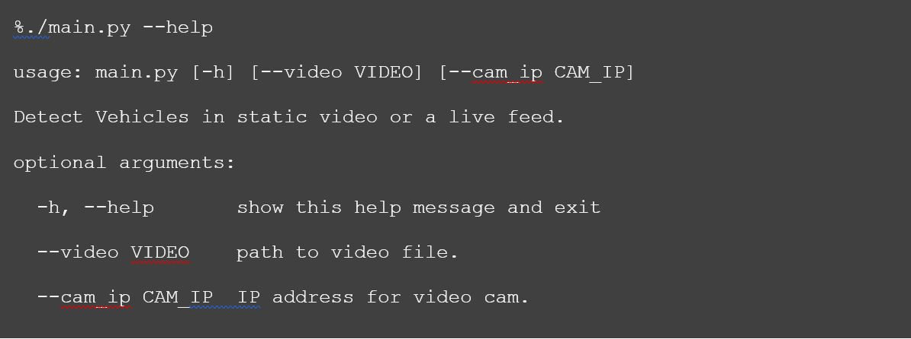
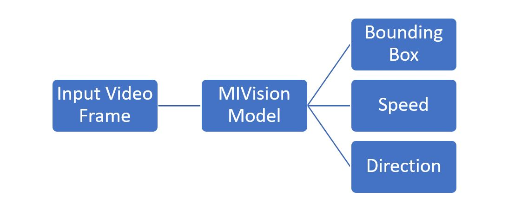
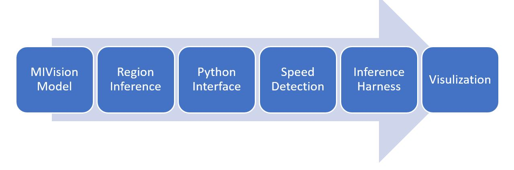
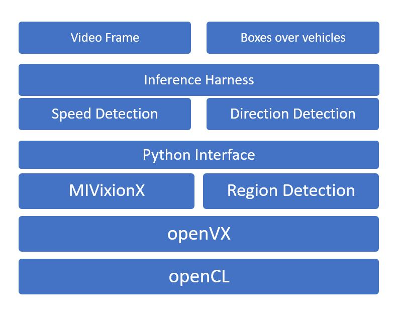

# Traffic Vision
This app detects cars/buses in a live traffic using deep learning network Yolo-V2. It has been optimized for AMD-GPUs using MIVisionX.

[](https://youtu.be/YASOovwds_A)

## Features
1. Detection of vechicle with bounding box
1. Detection of vehicle direction ((upward, downward) of travel 
1. Prediction the speed of the vehicle
1. Prediction of approximate vehicle type: bus/car.

## How to Run

### Use Model


### Demo

Demo uses a recorded video in the media dir
```
% ./main.py
('Loaded', 'yoloOpenVX')
OK: loaded 22 kernels from libvx_nn.so
OK: OpenVX using GPU device#0 (gfx900) [OpenCL 1.2 ] [SvmCaps 0 1]
OK: annCreateInference: successful
Processed a total of  102 frames
OK: OpenCL buffer usage: 87771380, 46/46
%
```
Here is the [link to YouTube video](https://youtu.be/YASOovwds_A) detecting cars, bounding boxes, car speed, and confidence scores.
### Other Examples

**recorded video**
> 1. ./main.py --video <path-to-video>/vid.mp4
  
**traffic cam ip** 
> 2. ./main.py --cam_ip 'http://166.149.104.112:8082/snap.jpg'

## Installation

### Prerequisites 

1. GPU: Radeon Instinct or Vega Family of Products with [ROCm](https://rocm.github.io/ROCmInstall.html) and OpenCL development kit
1. [Install AMD's MIVisionX toolkit](https://gpuopen-professionalcompute-libraries.github.io/MIVisionX/) : AMD's MIVisionX toolkit is a comprehensive computer vision and machine intelligence libraries, utilities
1. [CMake](http://cmake.org/download/)
1. [Google's Protobuf](https://github.com/google/protobuf)

### Steps

```
% git clone https://github.com/srohit0/trafficVision
```


**_1. Model Conversion_**
This steps downloads yolov2-tiny for voc dataset and converts to MIVision's openVX model 
```
% cd trafficVision/model
% bash ./prepareModel.sh
```

**_2. MIVision Model Compilation_**

```
% cd trafficVision
% make
```

**_3. Test App_**

```
% make test
```
It'll display detection all videos in media/ dir.

## Design
This section is for developers, who would like to port model from other frameworks including [tensorflow](https://github.com/tensorflow/models/blob/master/research/object_detection/g3doc/detection_model_zoo.md), [caffe](http://caffe.berkeleyvision.org/model_zoo.html) or [pytorch](https://pytorch.org/).

### High Level Design


### Lower Level Modules
These lower level modules can be found as python modules (files) or packages (directories) in this repository.


## Development

### Model Conversion
Follow model conversion process similar to the one described below.


### Infrastructure
Make sure you've infrastructure pre-requisites installed before you start porting neural network model for inferencing.


## Developed and Tested on
1. Hardware = AMD Ryzen Threadripper 1900X 8-Core Processor
1. Accelerator = Radeon Instinct™ MI25 Accelerator 
1. OS = Ubuntu 16.04 LTS
1. Python 2.7
1. MIVisionX 1.7.0
1. AMD OpenVX 0.9.9
1. GCC 5.4

## Credit
* **Schmitt, Mike**
* **Nagesh gowda, Kiriti**
* **Rawther, Rajy**
